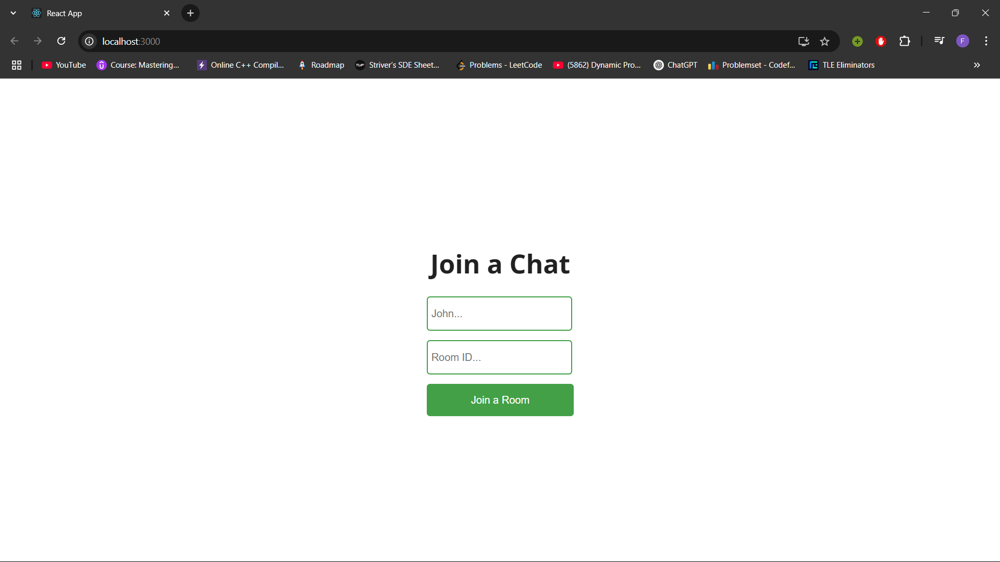
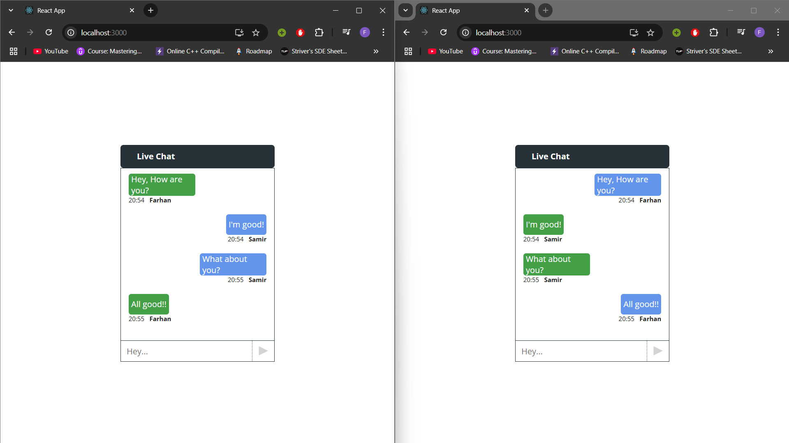
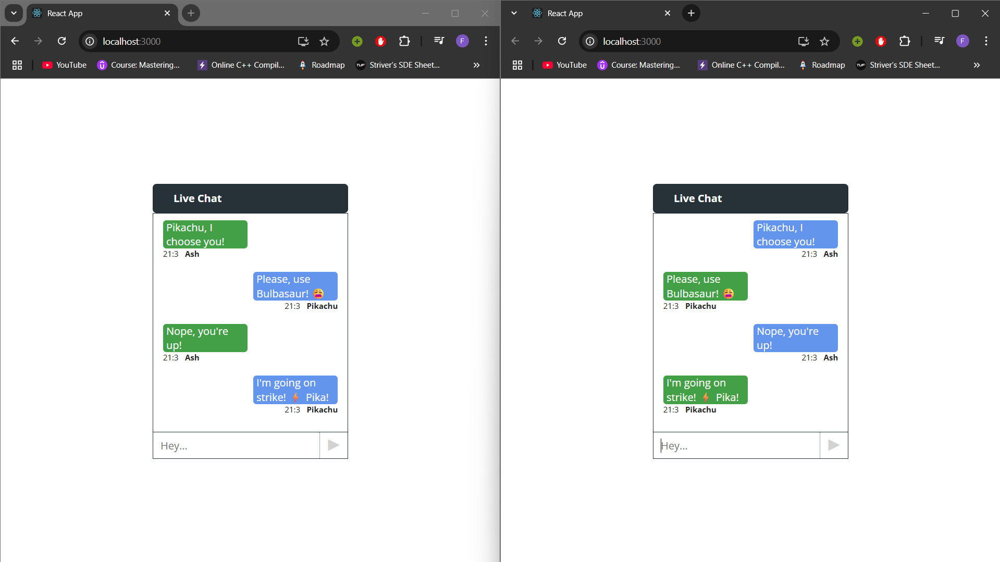

# 🧩 <Project Name>

Real‑time chat application built with **React**, **Node.js/Express**, and **Socket.io** for low‑latency, bidirectional communication.

---

## 🖼️ Screenshots

| Screen | Preview |
| ------ | ------- |
| Home |  |
| Join Room |  |
| Chat Room 1|  |
| Chat Room 2|  |

## 🚀 Tech Stack

| Layer      | Tech |
| ---------- | ---- |
| **Frontend** | React • Tailwind CSS |
| **Backend**  | Node.js • Express |
| **Realtime** | Socket.io |

---
